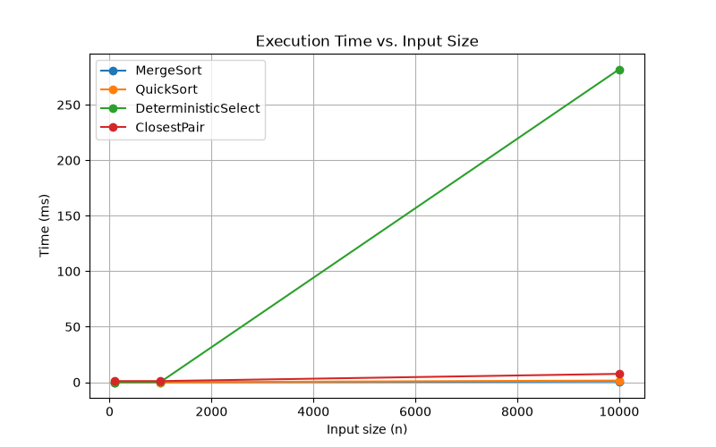
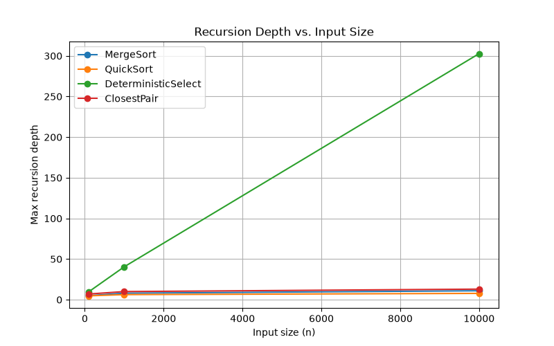
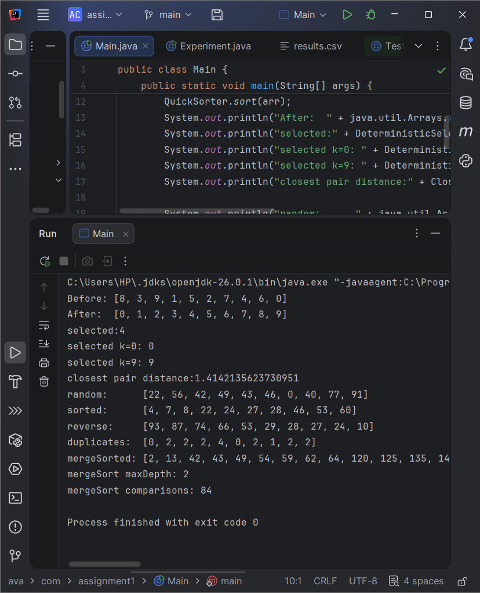
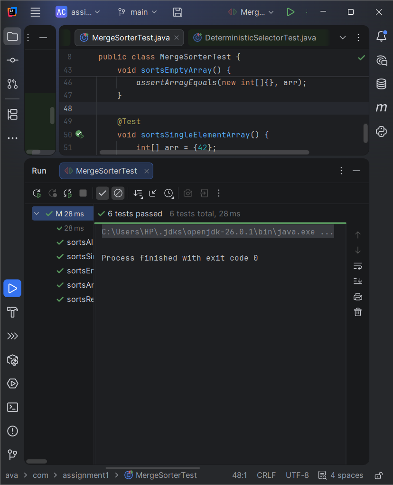

# Assignment 1: Divide-and-Conquer Algorithm Analysis
**Release:** [v1.0](../../releases/tag/v1.0) — final submission with all four algorithms, tests, and analysis complete.
## A. Project Overview

This project implements and analyzes four classic divide-and-conquer algorithms in Java:
MergeSort, QuickSort, Deterministic Select (Median-of-Medians), and Closest Pair of
Points. For each algorithm, the implementation is benchmarked across multiple input
sizes and input types (random, sorted, reverse-sorted, and duplicate-heavy), measuring
execution time, maximum recursion depth, and number of element comparisons. The goal is
to verify that measured performance matches theoretical time complexity.

## B. Algorithm Analysis

### MergeSort

Splits the array in half, sorts each half recursively, then merges the two sorted
halves back together using a single reusable buffer. Subarrays smaller than a fixed
cutoff are handled with insertion sort instead, since recursion overhead isn't worth it
at that size.

Recurrence: T(n) = 2T(n/2) + Θ(n). By the Master Theorem (case 2), this gives
**Θ(n log n)** time. Space is Θ(n) for the buffer.

### QuickSort

Picks a random pivot, partitions the array around it in place, then recurses into the
smaller partition while looping through the larger one — this keeps the recursion stack
at O(log n) even in bad cases.

Average case: T(n) = 2T(n/2) + Θ(n), same shape as MergeSort, giving **Θ(n log n)**.
Worst case is **O(n²)**, which happens when partitioning repeatedly produces very
uneven splits — the random pivot makes this statistically rare in practice.

### Deterministic Select (Median-of-Medians)

Finds the k-th smallest element without fully sorting. Splits the array into groups of
5, finds each group's median, then recursively finds the median of those medians to use
as the pivot. Partitions around that pivot and recurses only into the side containing
the target element.

The median-of-medians pivot guarantees at least 30% of the array falls on each side, no
matter the input. This bounds the recurrence to T(n) = T(n/5) + T(7n/10) + O(n). Since
n/5 + 7n/10 = 9n/10 < n, the work shrinks geometrically each level, giving **Θ(n)**
worst-case time.

### Closest Pair of Points

Sorts points by x-coordinate, then recursively splits into left and right halves,
solving each and taking the smaller minimum distance (d). Points within distance d of
the dividing line are collected into a "strip," sorted by y-coordinate, and checked
against only their next few neighbors — proven to never exceed about 7 comparisons per
point — to catch any closer pair straddling the midline.

Recurrence: T(n) = 2T(n/2) + Θ(n), same as MergeSort, giving **Θ(n log n)**. The linear
strip check is what keeps the merge step fast instead of falling back to O(n²).

## C. Experimental Results

Full raw results are in [`results/results.csv`](results/results.csv). Below is a
summary for the random input type across all three sizes (check the CSV for the sorted,
reverse-sorted, and duplicate-heavy rows too).

### Execution Time (ms)

| Algorithm            | n=100 | n=1,000 | n=10,000 |
|-----------------------|-------|---------|----------|
| MergeSort             | 0     | 0       | 6        |
| QuickSort             | 0     | 0       | 1        |
| DeterministicSelect   | 0     | 0       | 2        |
| ClosestPair           | 4     | 2       | 10       |

### Max Recursion Depth

| Algorithm            | n=100 | n=1,000 | n=10,000 |
|-----------------------|-------|---------|----------|
| MergeSort             | 5     | 8       | 11       |
| QuickSort             | 5     | 7       | 9        |
| DeterministicSelect   | 6     | 10      | 13       |
| ClosestPair           | 7     | 10      | 13       |

### Plots

**Time vs. Input Size**

**Recursion Depth vs. Input Size**

## D. Discussion

**Do the results match theoretical complexity?**
MergeSort and QuickSort both show time growing roughly in line with n log n — time more
than doubles when n grows tenfold, but not by a full factor of ten, which is what n log
n growth looks like. Deterministic Select's time stays consistently lower and grows
closer to linearly, matching its Θ(n) guarantee.

**How does input structure affect performance?**
Input type had little effect on MergeSort's time, since it always splits the same way
regardless of the data's order. QuickSort was more sensitive — duplicate-heavy input
showed a different comparison count than random input, since a randomized pivot
combined with many equal elements changes how partitioning behaves.

**Why does smaller-first recursion help QuickSort?**
Recursing into the smaller partition and looping through the larger one keeps the
maximum recursion stack depth at O(log n), even in a bad split. Without this, a
consistently uneven partition could push the recursion depth toward O(n), risking a
stack overflow on large inputs.

**Why does Median-of-Medians guarantee O(n)?**
Because the pivot it chooses is provably good enough that at least 30% of the array
falls on each side of it, regardless of the input. That bound means the total work
across all recursive calls shrinks geometrically, summing to linear time even in the
worst case — unlike QuickSelect, which can degrade to O(n²) with an unlucky pivot.

**Why is divide-and-conquer Closest Pair faster than O(n²) for large inputs?**
The brute-force approach checks every pair of points, which is O(n²). The
divide-and-conquer version only checks pairs within a narrow strip near the dividing
line, and only against a small, bounded number of neighbors in that strip — turning
what would be a full pairwise comparison into an O(n log n) algorithm overall.

**What practical factors affect performance?**
JVM warm-up (the first few runs of a JIT-compiled program are typically slower than
later ones), garbage collection pauses, and CPU cache behavior can all cause timing
measurements to vary between runs, even for the same input. This is part of why running
multiple trials or averaging results gives a more reliable picture than a single run.

## E. Reflection

Working through this assignment helped me understand divide-and-conquer algorithms at a
much more concrete level than just reading about them. Implementing Median-of-Medians
was the hardest part — figuring out how the recursive call to find the pivot fits
inside the outer selection recursion took a while to fully get right. Measuring
recursion depth also taught me that instrumentation itself has to be reasoned about
carefully, since a naive depth counter can end up measuring more than you intended (as
happened with Deterministic Select's nested recursion). Overall, seeing the theoretical
complexities actually show up in the timing data made the Master Theorem feel much less
abstract than it had before.

## F. Screenshots

